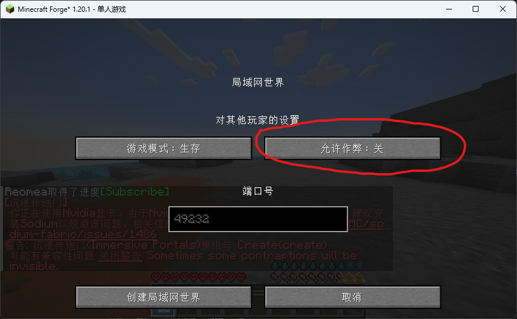
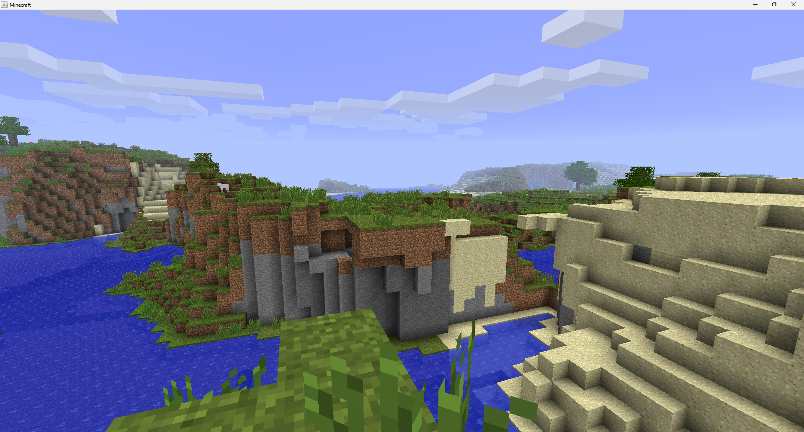

# CHENSRONER的百科

## 关于这个网站

> 访问速度可能有点慢

一个MC玩家的个人网站主要讲解攻略和模组推荐等内容

## MC相关网站推荐

- [Minecraft官网](https://www.minecraft.net/en-us/)
- [MCBBS-我的世界中文论坛](https://www.mcbbs.net/)
- [MC百科-我的世界中文百科](https://www.mcmod.cn/)
- [Modrinth-模组下载网站](https://modrinth.com/)
- [CurseForge-模组下载网站](https://www.curseforge.com/)
- [Namemc-优质皮肤网站](https://www.namemc.com/)
- [Github-很多优质模组的聚集地](https://www.github.com/)


## 模组推荐

- [JEI物品管理器-一个能查询物品合成的配方](https://modrinth.com/mod/jei)
- [Xaeros Minimap-方便的小地图工具](https://modrinth.com/mod/xaeros-minimap)
- [苹果皮-查看当前角色的饥饿状态](https://modrinth.com/mod/appleskin)

## 一些小功略

### Java版极限存档开启作弊

> 首先进入存档，然后按下键盘上的ESC键，进入游戏菜单，选择“对局域网开放”，然后把右边的允许作弊改成开就行了


### Java版Forge和Fabric模组强行兼容


> 前提条件必须是1.20.1或以上的安装了Forge模组加载器的版本

要想让Forge和Fabric模组兼容可以安装两个模组


- [信雅互联](https://modrinth.com/mod/connector)
- [前置模组](https://modrinth.com/mod/forgified-fabric-api)

安装完成后，部分Fabric模组可以跟Forge模组兼容，部分模组则不兼容。

### 一些特殊方块的获取指令

- 命令方块

```
/give @s command_block
```

- 结构方块

```
/give @s structure_block
```

- 结构空位

```
/give @s structure_void
```

- 允许方块
```
/give @s allow
```


## 游戏彩蛋

### 彩虹羊

给羊的命名jeb_然后你就会发现羊的毛色会不断的变化


## 种子推荐

### 1.12背景图



- 版本：远古beta1.7.3

- 种子：```2151901553968352745```

- 坐标：60 76 -70